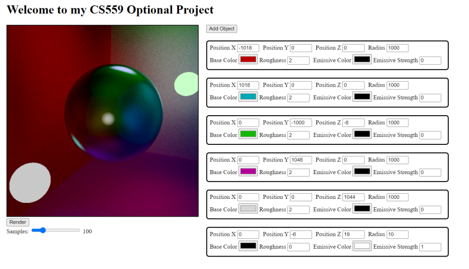
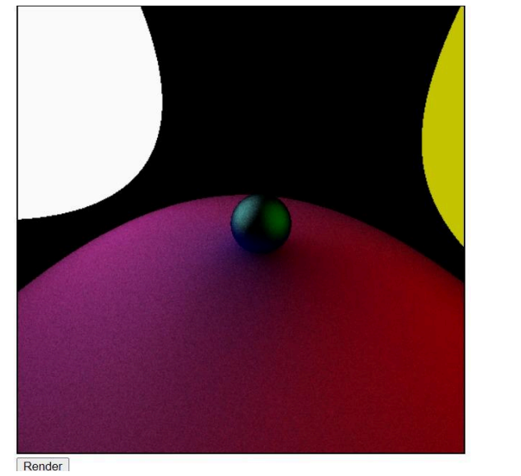
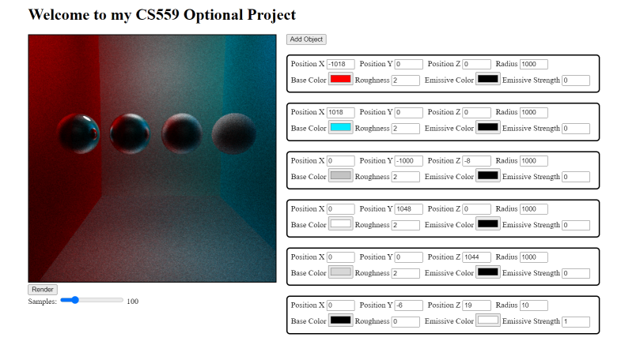
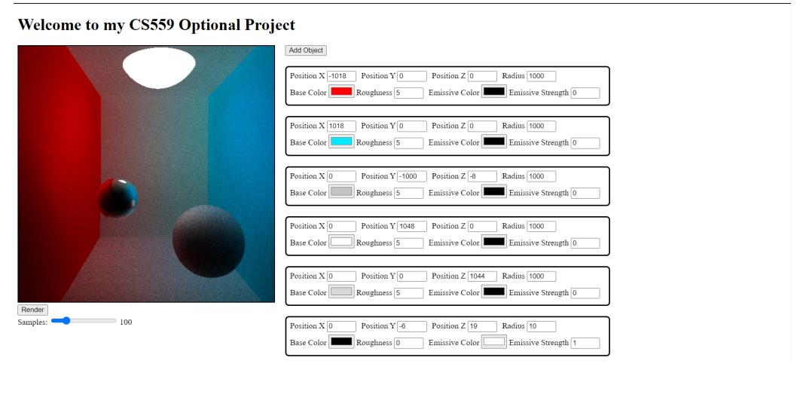

# Ray Tracer

This is a basic ray tracer created from the ground up in JavaScript, using only the Canvas Drawing API.

## Table of Contents

- [Introduction](#introduction)
- [Features](#features)
- [Setup](#setup)
- [Usage](#usage)
- [Examples](#examples)

## Introduction

Ray tracing is a rendering technique that mimics the way light interacts with objects to create realistic images. This project is a straightforward implementation of a ray tracer, written in JavaScript. It leverages the HTML5 Canvas API to render scenes directly in the browser.

## Features

- Fundamental ray tracing algorithm
- Simulates light reflection with a pseudo-realistic approach
- Supports spheres of varying sizes
- Shading incorporates emissive, color, and roughness properties
- Customizable scene setup
- Lightweight viewport mode for real-time adjustments
- FPS counter
- Adjustable sampling for rendered images

## Setup

1. Clone the repository:

   ```sh
   git clone https://github.com/simartathgir/Ray-Tracer.git
   cd Ray-Tracer
   ```
2. Build a docker image:
   ```sh
   docker build -t <ImageName> .
   ```
3. Run docker
   ```sh
   docker run -p 80:80 <ImageName>
   ```
4. Open localhost  in your browser of choice.

## Usage

1. Click the 'Add Object' button to place a new sphere at the origin.
2. Modify object parameters such as position, size, color, roughness, emissive color, and emissive strength.
3. Customize and configure the scene to your liking (ensure you add emissive sources, or the scene will be completely dark).
4. Use the WASD keys and arrow keys to adjust the camera's position and rotation in viewport mode.
5. Adjust the sample count for the final render (higher sample counts improve quality but take longer to render).
6. Click the 'Render' button to generate the ray-traced output (open the console first to track rendering progress).

## Examples
1. 
2. 
3. 
4. 
   
